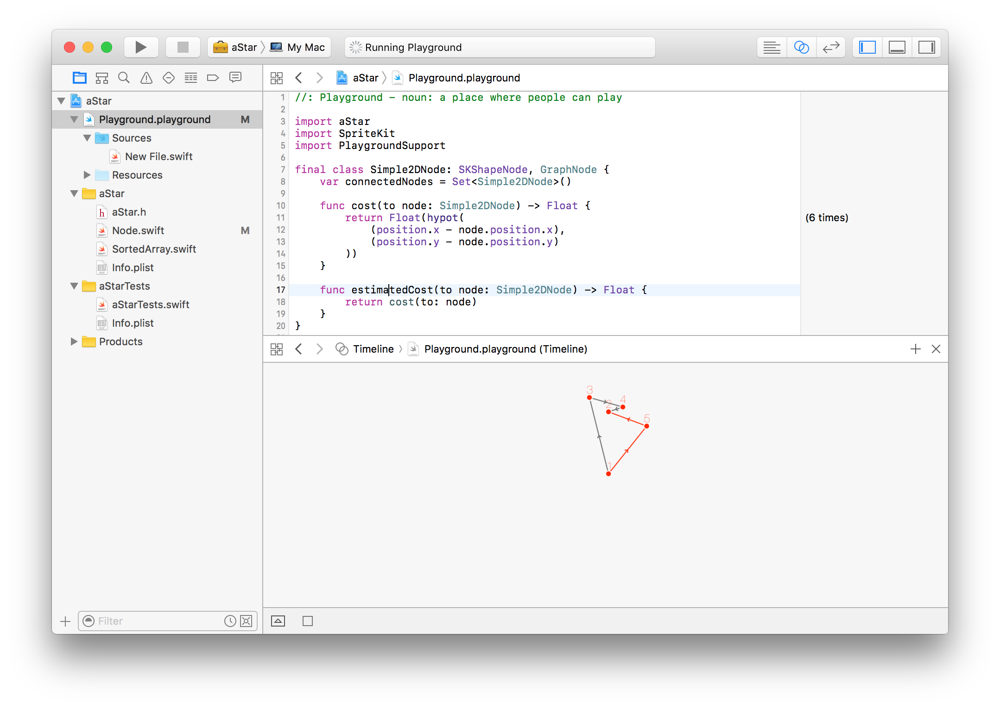

# A-Star

A* (A star) pathfinding algorithm implementation in Swift 4.0 (Playground included) using protocol oriented programming.

Add pathfinding to your graph just by implementing the 3 requirements of the [GraphNode protocol](https://dev1an.github.io/A-Star/Protocols/GraphNode.html).
