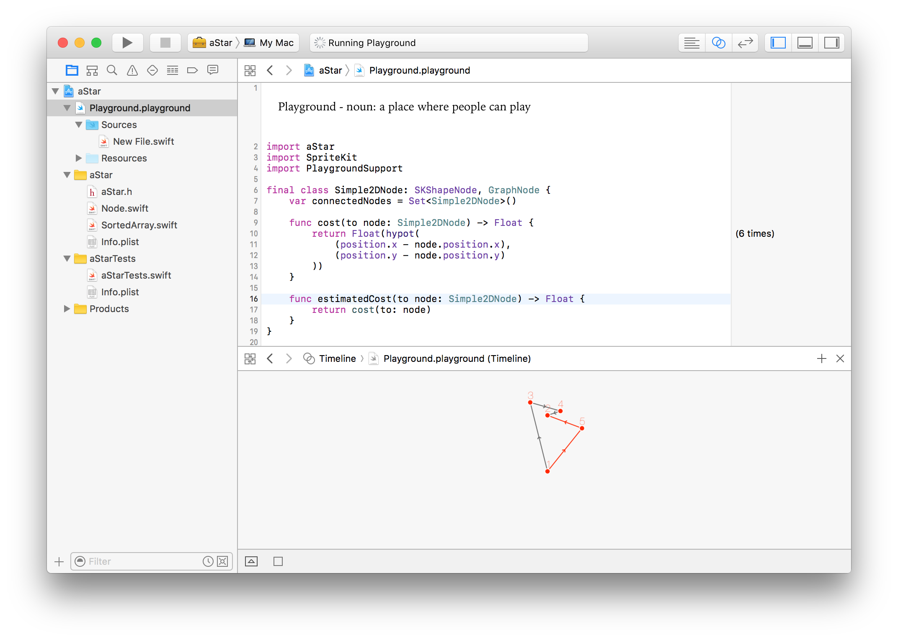

# A-Star

A* (A star) pathfinding algorithm implementation in Swift 5.0 (Playground included) using protocol oriented programming.

Add pathfinding to your graph just by implementing the 3 requirements of the [GraphNode protocol](https://dev1an.github.io/A-Star/Protocols/GraphNode.html).

## Playground

- To try the playground open: aStar.xcodeproj
- Build the framework (`command` + `b`)
- Click on Playground.playground

## Install with swift package manager

Add this package to the dependencies of your project using SPM 🎉
